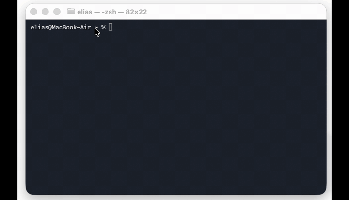

# dum dictation

[](https://github.com/eliasmocik/dum-dictation/actions/workflows/tests.yml)

Local, real-time dictation that gets your technical vocabulary right.



Most dictation tools mishear technical terms: `git`, `kubectl`, `nginx`, `PostgreSQL` and
`TanStack Query` come out as "get hub" or "engine x". dum recognizes them, and adds capitalization
and punctuation as you speak. Everything runs on your machine, and it types straight into whatever
application you're in. A local, open alternative to Wispr Flow and Superwhisper.

## Demo

A full walkthrough, with sound:

https://github.com/user-attachments/assets/20cf0b37-7b8b-4586-abd8-e8bac6663766

## What you need

- **macOS** (Apple Silicon, M-series) - primary, best-tested
- **Windows 10/11** - works, still beta (built and tested by a contributor) ([setup](#on-windows))
- **Linux** (X11) - experimental, looking for a contributor ([setup](#on-linux))
- Python 3.12

## Install (macOS)

```sh
curl -fsSL https://raw.githubusercontent.com/eliasmocik/dum-dictation/main/install.sh | bash
```

Clones into `./dum-dictation`, runs `./setup` (venv + deps + speech/correction models), then asks
for [permissions](#permissions-macos-one-time). By hand instead:

```sh
git clone https://github.com/eliasmocik/dum-dictation.git
cd dum-dictation
./setup
```

The one-liner is macOS-only. Windows and Linux: see below.

## Permissions (macOS, one time)

Grant these to the app you ran `./dum` from (Terminal, iTerm, or VS Code), then **quit and reopen it**:

1. **Microphone**
2. **Accessibility**
3. **Input Monitoring**

macOS usually prompts on first run. Otherwise: System Settings => Privacy & Security.

## Using it

```sh
./dum
```

- Double-tap **LEFT ⌘** to start/stop. Words appear live; a pause locks the sentence in. Ctrl+C quits.
- Pick a mic: `DUM_MIC="MacBook Air" ./dum` (by name) or `./dum --mic 1` (by index; list them with
  `.venv/bin/python src/live.py --list-devices`).

### Menu bar + auto-start

```sh
./dum --tray                 # menu-bar icon (green = listening, grey = idle)
./dum --install-autostart    # start at login, relaunch on crash (--autostart-status, --uninstall-autostart)
```

Auto-start re-asks for the three permissions (this time for the venv `python`).

## On Windows

In **PowerShell** (Python 3.12 on your PATH):

```powershell
git clone https://github.com/eliasmocik/dum-dictation.git
cd dum-dictation
.\setup.ps1
.\dum.ps1
```

- Double-tap **RIGHT Ctrl** to start/stop (change it: `.\dum.ps1 --config`).
- Only permission: **microphone** (Settings => Privacy & security => Microphone).
- Tray + logon: `.\dum.ps1 --tray`, `.\dum.ps1 --install-autostart`.

> WSL? The tool needs the real keyboard, mic and screen (Windows owns those), so run the Windows
> version above.

## On Linux

Linux support is new - if something doesn't work on your distro or session, please
open an issue so we can fix it. On pure Wayland the per-app focus guard is not yet
available (Linux has no reliable equivalent of macOS/Windows accessibility APIs).

Linux is supported on X11 and Wayland. The `./setup` script auto-detects your
distro and session type, and installs the required system packages.

### Quick install

```sh
git clone https://github.com/eliasmocik/dum-dictation.git
cd dum-dictation
./setup                              # installs system deps + venv + models
./dum                                # double-tap RIGHT Ctrl to start/stop

# Optional:
./dum --tray                         # system tray icon (green = listening)
./dum --install-autostart            # systemd --user service (start at login)
./dum --config                       # re-run mic/hotkey setup wizard
```

### What gets installed

| Session | Typing | Clipboard | Sound |
|---------|--------|-----------|-------|
| **X11** | `xdotool` | `xclip` | `canberra-gtk-play` bell (terminal bell fallback) |
| **Wayland** | `ydotool`* | `wl-clipboard` | same |

\* Wayland typing uses **`ydotool`**, which needs its **`ydotoold` daemon** running
(socket at `/tmp/.ydotool_socket`). If the daemon isn't running, dum automatically
falls back to `pynput` typing (slower, and layout-dependent). Start it once with
`ydotoold &`, or enable a service for it. On X11, `xdotool` works without any daemon.

The setup script detects your distro (Debian/Ubuntu, Fedora, Arch, openSUSE,
NixOS) and session type automatically, installing everything needed.

> **Note on Ubuntu 22.04 / Debian stable:** these don't ship `python3.12` in their
> default repos, so `./setup` fails early. Either run `scripts/install-linux-deps.sh`
> first (it adds the `deadsnakes` PPA on Ubuntu), or install Python 3.12 manually
> before `./setup`.

### Manual install (if you prefer)

**Debian / Ubuntu / Mint:**
```sh
sudo apt install xdotool xclip wl-clipboard ydotool libcanberra-gtk3-module \
  portaudio19-dev cmake gcc g++ python3.12 python3.12-venv libappindicator3-1
```

**Fedora / RHEL:**
```sh
sudo dnf install xdotool xclip wl-clipboard ydotool libcanberra-gtk3 \
  portaudio-devel cmake gcc gcc-c++ python3.12 libappindicator-gtk3
```

**Arch / Manjaro:**
```sh
sudo pacman -S xdotool xclip wl-clipboard ydotool libcanberra portaudio \
  cmake gcc libappindicator python
```

**openSUSE:**
```sh
sudo zypper install xdotool xclip wl-clipboard ydotool libcanberra-gtk3-module \
  portaudio-devel cmake gcc gcc-c++ python312 libayatana-appindicator1
```

### Tray icon

The system tray needs a StatusNotifierItem host (built into KDE and most DEs, and
available on GNOME via the **AppIndicator** extension) or a standalone provider like
`snixd` or `trayer`. Install `libappindicator-gtk3` or `libayatana-appindicator` —
the setup script does this automatically for your distro.

On a session with no StatusNotifierItem host, `./dum --tray` prints a clear message
and continues running with just the global hotkey (no icon). The dictation itself is
unaffected.

> **Focus guard:** on pure Wayland there is no reliable way to name the focused app,
> so the focus-away hard stop (alt-tab safety) is **disabled** there. On X11 it works
> via `xdotool`. Run under XWayland if you want the focus guard.

## Privacy

Everything stays on your machine. Optional local-only log (off by default) that remembers dictations
so misheard words get fixed over time. Details: [`docs/DOGFOOD.md`](docs/DOGFOOD.md).

## Want to help?

- Feedback or bugs: [Discussions](https://github.com/eliasmocik/dum-dictation/discussions) or [open an issue](https://github.com/eliasmocik/dum-dictation/issues/new)
- Vocab fix: [`docs/CONTRIBUTING.md`](docs/CONTRIBUTING.md)
- How it works: [`docs/ARCHITECTURE.md`](docs/ARCHITECTURE.md), [`docs/DEV-NOTES.md`](docs/DEV-NOTES.md)

## License

MIT (see [`LICENSE`](LICENSE)). Free to use, fork and build on.
