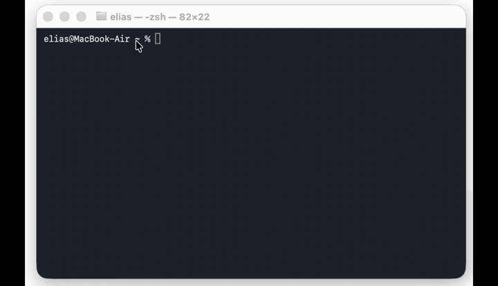

# dum dictation

[](https://github.com/eliasmocik/dum-dictation/actions/workflows/tests.yml)

Local, real-time dictation that gets your technical vocabulary right.



https://github.com/user-attachments/assets/20cf0b37-7b8b-4586-abd8-e8bac6663766

## What you need

- **macOS** (Apple Silicon, M-series)
- **Windows 10/11** - beta (built and tested by a contributor) ([setup](#on-windows))
- **Linux** (X11) - looking for a contributor ([setup](#on-linux))

## Install (macOS)

Recommended: download the app from the DMG, following **[→ Download dum for Mac](https://github.com/eliasmocik/dum-dictation/releases/latest)**

<details>
<summary>Or run it from source</summary>

```sh
git clone https://github.com/eliasmocik/dum-dictation.git
cd dum-dictation && ./setup && ./dum
```

Grant the three permissions to your terminal, then quit and reopen it. `./dum --tray` for the
menu bar, `./dum --config` to redo the mic/hotkey picker.

</details>

## On Windows

In **PowerShell** (Python 3.12 or 3.13 on your PATH - 3.14 isn't supported on Windows yet; with no
Python at all, `setup.ps1` fetches its own):

```powershell
git clone https://github.com/eliasmocik/dum-dictation.git
cd dum-dictation
.\setup.ps1
.\dum.ps1
```

- Double-tap **RIGHT Ctrl** to start/stop (change it: `.\dum.ps1 --config`).
- Only permission: **microphone** (Settings => Privacy & security => Microphone).
- Tray + logon: `.\dum.ps1 --tray`, `.\dum.ps1 --install-autostart`.

## On Linux

> **Experimental!** Looking for a Linux contributor. Reach out on
> [Discussions](https://github.com/eliasmocik/dum-dictation/discussions) or [@eliasmocik](https://github.com/eliasmocik).

```sh
sudo apt install xdotool xclip      # or wl-clipboard on Wayland
git clone https://github.com/eliasmocik/dum-dictation.git
cd dum-dictation
./setup                              # skips the Apple-only LLM
./dum                                # double-tap RIGHT Ctrl to start/stop
./dum --tray
./dum --install-autostart            # systemd --user service
```

## Privacy

Everything stays on your machine. Optional local-only log (off by default) that remembers dictations
so misheard words get fixed over time. Details: [`docs/DOGFOOD.md`](docs/DOGFOOD.md).

## Want to help?

- Feedback or bugs: [Discussions](https://github.com/eliasmocik/dum-dictation/discussions) or [open an issue](https://github.com/eliasmocik/dum-dictation/issues/new)
- Vocab fix: [`docs/CONTRIBUTING.md`](docs/CONTRIBUTING.md)
- How it works: [`docs/how-it-works.md`](docs/how-it-works.md) (the writeup), [`docs/ARCHITECTURE.md`](docs/ARCHITECTURE.md), [`docs/DEV-NOTES.md`](docs/DEV-NOTES.md)

## License

MIT (see [`LICENSE`](LICENSE)).
